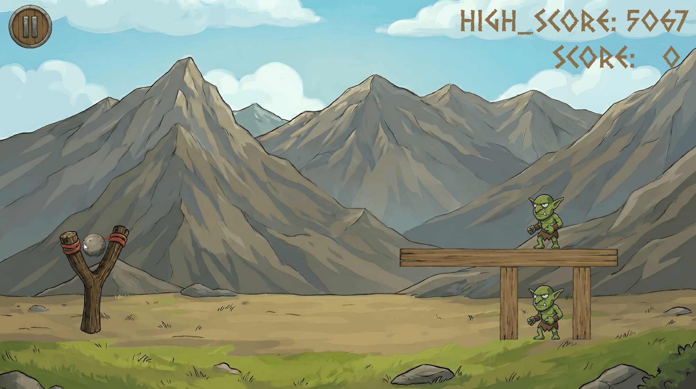

# 2D Physics Game Engine (Python + Pymunk)


## Visuals


An architectural showcase of a 2D physics-based game engine built with Python, Pygame, and Pymunk.
This project demonstrates **Software Engineering best practices**, including State Machine architecture, Data-Driven design, and automated CI/CD pipelines.

---

## 🚀 Technical Highlights

### 1. Robust Architecture (State Pattern)
The core logic utilizes the **State Design Pattern** to manage game flow (Menu -> Gameplay -> Pause -> Summary).
* **Template Method Pattern:** Implemented in `BaseState` to standardize the update/draw loops and input handling across all states.
* **Event Injection System:** Decoupled UI logic from the main loop using a custom `GameSignal` system and dependency injection.
* **Context Retention:** Implemented a non-destructive `PauseState` using the **Overlay Pattern**, preserving the gameplay context in memory.

### 2. Physics & Mathematics
* **Advanced Simulation:** Integration with **Pymunk** for rigid body dynamics, gravity handling, and collision detection.
* **Vector Math:** utilized for calculating trajectory predictions, slingshot tension (Hooke's Law approximation), and dynamic impulse vectors.
* **Spatial Queries:** Optimized performance using `pymunk.ShapeQuery` for precise input detection without relying on heavy sprite-mask collisions.

### 3. Engineering Excellence
* **CI/CD Pipeline:** Fully automated testing workflow via **GitHub Actions**. Runs unit tests in a headless environment (using dummy video drivers) on every push.
* **Data-Driven Design:** All game entities (mass, friction, textures) and UI layouts are injected via external **JSON** configuration files, adhering to the **Open/Closed Principle**.
* **Clean Code Standards:** 100% Type Hinting coverage, extensive Docstrings, and adherence to SRP (Single Responsibility Principle) in class design (e.g., dedicated `InputData` DTOs).

---

## 🛠️ Installation & Setup

Ensure you have Python 3.10+ installed.

1.  **Clone the repository:**
    ```bash
    git clone https://github.com/xKacper13x/2d-physics-game-architecture.git
    cd 2d-physics-game-architecture
    ```

2.  **Install dependencies:**
    ```bash
    pip install -r requirements.txt
    ```

3.  **Run the application:**
    ```bash
    python main.py
    ```

4.  **Run Tests:**
    ```bash
    python -m pytest
    ```

---

## 🎮 Controls

* **Left Mouse Button (Drag & Release):** Aim and launch projectiles from the slingshot.
* **ESC:** Pause the game / Resume.
* **F11:** Toggle fullscreen.
* **Mouse Interaction:** Navigate UI menus.

---

## 📂 Project Structure

```text
├── .github/workflows/   # CI/CD Configuration (GitHub Actions)
├── core/                # Core engine logic (App, InputHandler, Signals)
├── entities/            # Game objects (Projectile, Enemy, Structure)
├── services/            # Data persistence and Logic services
├── states/              # State Machine implementations
├── objects_config_files/# JSON Metadata for levels and UI
├── tests/               # Unit tests (Pytest)
├── main.py              # Application Entry Point
```

---

## 📄 License

Distributed under the MIT License. See `LICENSE` for more information.

## 📬 Contact

Kacper - [@xKacper13x](https://github.com/xKacper13x) - [kacperkrzyzewski20@gmail.com]

Project Link: [https://github.com/xKacper13x/2d-physics-game-architecture](https://github.com/xKacper13x/2d-physics-game-architecture)
